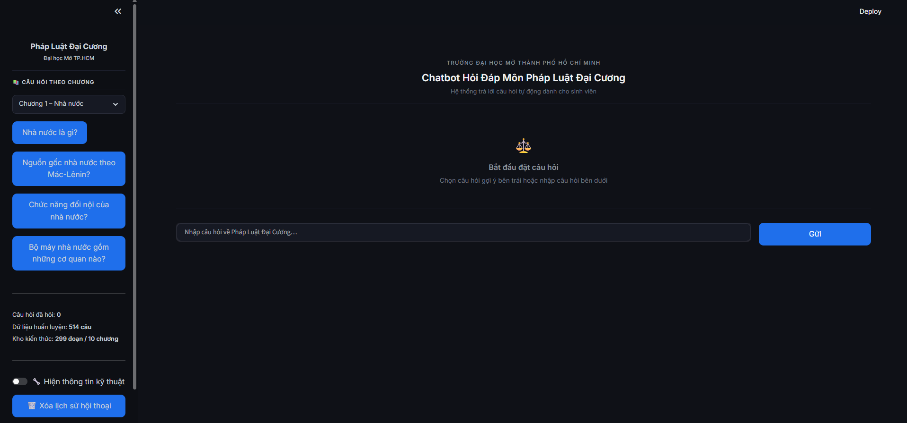
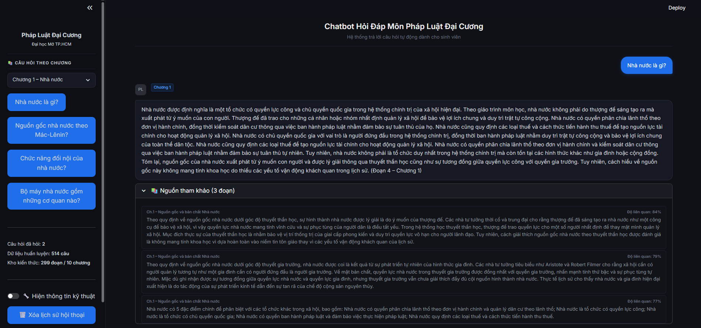
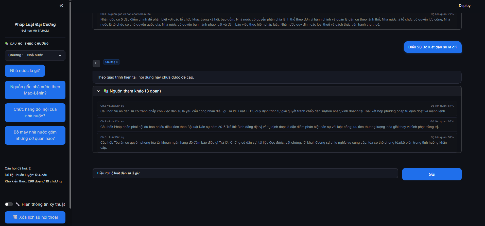

# XÂY DỰNG HỆ THỐNG HỎI ĐÁP MÔN PHÁP LUẬT ĐẠI CƯƠNG — LawChat

[](https://huggingface.co/vinai/phobert-base)
[](https://huggingface.co/intfloat/multilingual-e5-large)
[](https://ollama.com/mrjacktung/phogpt-4b-chat-gguf)
[](https://github.com/facebookresearch/faiss)
[](https://docs.streamlit.io/)
[](https://www.langchain.com/)
[](https://en.wikipedia.org/wiki/MIT_License)

Hệ thống hỏi đáp tự động cho môn **Pháp luật Đại cương** tại Trường Đại học Mở TP.HCM, xây dựng trên kiến trúc **Retrieval-Augmented Generation (RAG) 3 tầng**. Hệ thống truy xuất các đoạn văn bản liên quan từ giáo trình gốc và sinh câu trả lời được ràng buộc hoàn toàn vào ngữ cảnh đó — không phụ thuộc vào bất kỳ API bên ngoài nào.

---

## Mục lục

- [Tổng quan](#tổng-quan)
- [Giao diện hệ thống](#giao-diện-hệ-thống)
- [Kiến trúc hệ thống](#kiến-trúc-hệ-thống)
- [Chi tiết từng tầng](#chi-tiết-từng-tầng)
- [Kết quả đánh giá](#kết-quả-đánh-giá)
- [Cấu trúc dự án](#cấu-trúc-dự-án)
- [Cài đặt](#cài-đặt)
- [Hướng dẫn sử dụng](#hướng-dẫn-sử-dụng)
- [Cấu hình](#cấu-hình)
- [Hạn chế đã biết](#hạn-chế-đã-biết)

---

## Tổng quan

Chatbot tổng quát không phù hợp cho bài toán hỏi đáp pháp luật vì hai lý do cốt lõi:

- **Hallucination** — mô hình có xu hướng bịa đặt thông tin pháp lý không có trong giáo trình.
- **Thiếu trích dẫn nguồn** — không thể chỉ rõ thông tin đến từ chương nào, mục nào của giáo trình.

LawChat giải quyết vấn đề này bằng cách ràng buộc toàn bộ quá trình sinh câu trả lời vào các đoạn văn bản được truy xuất trực tiếp từ giáo trình, đồng thời hiển thị **minh bạch nguồn trích dẫn** cho mỗi câu trả lời.

**Các tính năng chính:**

-  **Phân loại câu hỏi thông minh** — PhoBERT tự động xác định câu hỏi thuộc chương nào, thu hẹp không gian tìm kiếm từ 1.034 chunks xuống còn phạm vi 1 chương khi đủ tự tin.
-  **Truy xuất lai (Hybrid Search)** — kết hợp Dense Retrieval (E5-Large + FAISS) và Sparse Retrieval (BM25) để bắt được cả ngữ nghĩa lẫn từ khóa pháp lý đặc thù.
-  **Sinh câu trả lời có kiểm soát** — PhoGPT-4B với Plain-text prompt + Custom modelfile (phogpt-legal), ràng buộc chặt chẽ vào ngữ cảnh được truy xuất.
-  **Nguồn tham khảo minh bạch** — mỗi câu trả lời đi kèm danh sách đoạn trích được dùng, kèm điểm liên quan.
-  **Hoàn toàn cục bộ** — toàn bộ suy luận chạy qua Ollama, không gửi dữ liệu ra ngoài.

---

## Giao diện hệ thống

### Màn hình chính

Giao diện web với menu câu hỏi gợi ý phân loại theo 10 chương bên trái, ô nhập câu hỏi tự do bên dưới.



---

### Câu trả lời kèm nguồn tham khảo

Khi sinh viên đặt câu hỏi *"Nhà nước là gì?"*, hệ thống phân loại đúng **Chương 1** (confidence 84%), truy xuất 3 đoạn liên quan và sinh câu trả lời đầy đủ dựa hoàn toàn trên ngữ cảnh — không bịa đặt thông tin ngoài giáo trình.



> Mỗi nguồn tham khảo hiển thị tên chủ đề và **độ liên quan (%)** giúp sinh viên kiểm chứng thông tin.

---

### Hành vi từ chối đúng đắn

Khi được hỏi *"Điều 20 Bộ luật Dân sự là gì?"*, hệ thống phân loại đúng **Chương 8** nhưng trả lời *"Theo giáo trình hiện tại, nội dung này chưa được đề cập"* — phản ánh đúng giới hạn kho tri thức vì giáo trình không trích dẫn từng điều luật theo số thứ tự.



> Đây là hành vi mong muốn: thà từ chối còn hơn bịa đặt thông tin pháp lý sai.

---

## Kiến trúc hệ thống

```
Câu hỏi người dùng
        │
        ▼
┌─────────────────────────────────────────────┐
│  Tầng 1 — PhoBERT Classifier                │
│  • Dự đoán chương (1–10)                    │
│  • Tính confidence và margin                │
│  • Quyết định: Scoped hoặc Global           │
└─────────────────────────────────────────────┘
        │
        ▼
┌─────────────────────────────────────────────┐
│  Tầng 2 — Hybrid Retrieval                  │
│  • Dense : multilingual-e5-large + FAISS    │
│  • Sparse: BM25 + underthesea tokenizer     │
│  • score = α·dense + (1−α)·bm25            │
│  • Chapter Boost khi ở chế độ Global       │
└─────────────────────────────────────────────┘
        │
        ▼
┌───────────────────────────────────────────────────────┐
│  Tầng 3 — PhoGPT-4B (Ollama)                          │
│  • Plain-text prompt + Custom modelfile (phogpt-legal)│
│  • Ràng buộc hoàn toàn vào ngữ cảnh                   │
│  • Hậu xử lý loại bỏ artifact định dạng               │
└───────────────────────────────────────────────────────┘
        │
        ▼
Câu trả lời + Danh sách đoạn tham khảo
```

---

## Chi tiết từng tầng

### Tầng 1 — Phân loại câu hỏi (PhoBERT)

Bộ phân loại sử dụng `vinai/phobert-base` được fine-tune trên **735 câu hỏi có nhãn**, bao phủ 10 chương của giáo trình. Văn bản đầu vào được tách từ bằng `underthesea` trước khi tokenize, nhất quán với cách pre-train của PhoBERT.

Với mỗi câu hỏi, bộ phân loại sinh ra phân phối xác suất trên 10 lớp. Hai giá trị dẫn xuất điều khiển hành vi ở tầng sau:

- `confidence` — xác suất của lớp được dự đoán cao nhất
- `margin` — khoảng cách giữa xác suất top-1 và top-2

Khi cả hai vượt ngưỡng tương ứng (`CONFIDENCE_THRESHOLD = 0.45`, `MARGIN_THRESHOLD = 0.15`), pipeline chuyển sang chế độ **Scoped**: chỉ các chunk thuộc chương được dự đoán mới được đưa vào tính điểm. Ngược lại, hệ thống fallback sang chế độ **Global**, tìm kiếm toàn bộ 1.034 chunk.

Các ngưỡng được chọn qua grid search trên tập validation, tối ưu hóa tích của tỷ lệ Scoped và độ chính xác top-2.

### Tầng 2 — Truy xuất lai (Hybrid Retrieval)

Kho tri thức gồm **1.034 chunk** văn bản trích từ giáo trình, được bổ sung thêm 735 cặp hỏi-đáp dạng FAQ để cải thiện recall trên các câu hỏi ngắn, trực tiếp.

**Dense retrieval** mã hóa câu hỏi và đoạn văn bằng `intfloat/multilingual-e5-large` (prefix câu hỏi: `query:`, prefix đoạn văn: `passage:`). Embedding được lưu trong FAISS `IndexFlatIP` và tính sẵn khi khởi động. Độ tương đồng là cosine trên vector đã L2-normalize.

**Sparse retrieval** dùng BM25 (`rank-bm25`) trên token đã tách từ. Phương pháp này bổ trợ cho dense retriever với các câu hỏi chứa thuật ngữ pháp lý cụ thể, số điều luật, hoặc tên riêng mà embedding có thể không nắm bắt tốt.

Điểm tổng hợp được tính theo công thức:

```
hybrid_score = alpha * dense_score + (1 - alpha) * bm25_score_normalized
```

Trọng số `alpha` và các tham số khác (`score_gate`, `chapter_boost`) được tối ưu tự động qua `rag/evaluate_rag.py`.

Ở chế độ Global, hệ số nhân `chapter_boost` được áp dụng lên điểm của các chunk thuộc chương được dự đoán trước khi xếp hạng cuối — kết hợp sức mạnh của cả classifier lẫn hybrid retrieval.

### Tầng 3 — Sinh câu trả lời (PhoGPT-4B)
Các đoạn văn được truy xuất ghép thành một khối ngữ cảnh và đưa vào prompt theo định dạng plain-text (không dùng ChatML) vì PhoGPT-4B được fine-tune theo format USER / ASSISTANT của SentencePiece. System prompt yêu cầu model chỉ trả lời dựa trên ngữ cảnh được cung cấp, và trả lời đúng một câu fallback cố định nếu ngữ cảnh không đủ thông tin.

Model được tạo lại qua ollama create với modelfile tùy chỉnh để loại bỏ stop token mặc định (<s>, </s>) vốn khiến output bị cắt ngắn sau 1–2 câu. Mỗi chunk được giới hạn còn 600 ký tự trước khi đưa vào prompt để kiểm soát độ trễ và tránh vượt quá context window hiệu dụng.

Đầu ra được lọc qua bộ hậu xử lý loại bỏ các artifact định dạng còn sót lại, Cơ chế phát hiện hallucination so sánh câu trả lời với lịch sử hội thoại, tự động fallback về đoạn RAG liên quan nhất nếu phát hiện model đang lặp lại câu trả lời cũ.

---

## Kết quả đánh giá

Đánh giá thực hiện trên **28 câu hỏi** soạn riêng, bao phủ đủ 10 chương.

### Bộ phân loại PhoBERT

| Chỉ số | Giá trị |
|---|---|
| Accuracy | 76,58% |
| Macro F1 | 72,90% |
| Weighted F1 | 74,30% |
| Cohen's Kappa (κ) | 0,7388 — *Good Agreement* |

### Độ chính xác truy xuất

| Chỉ số | Giá trị |
|---|---|
| Keyword Hit@1 | 89,29% |
| Chapter Hit@1 | 53,57% |
| Chapter Hit@3 | **82,14%** |
| Chapter Hit@5 | 92,86% |
| MRR | 0,678 |
| Hybrid score trung bình (top-1) | 0,748 |

### Phân bổ chiến lược tìm kiếm

| Chế độ | Số câu | Tỷ lệ |
|---|---|---|
| Scoped (thu hẹp theo chương) | 2 | 7,1% |
| Global (tìm toàn bộ) | 26 | 92,9% |

### Tham số tối ưu từ grid search (16 tổ hợp)

| Tham số | Giá trị tối ưu |
|---|---|
| `score_gate` | 0,25 |
| `chapter_boost` | 1,10 |
| `alpha` | 0,60 |
| Score tổng hợp (0,6×Hit@3 + 0,4×MRR) | **0,755** |

---

## Cấu trúc dự án

```
legal-chatbot-phapluat/
│
├── app/
│   ├── streamlit_app.py      # Giao diện web Streamlit
│   └── pipeline.py           # Singleton wrapper thread-safe cho RAGPipeline
│
├── config/
│   ├── settings.yaml         # Tham số runtime (tự động cập nhật từ grid search)
│   └── settings.py           # Đọc và load config
│
├── data/
│   ├── classification.csv    # 735 câu hỏi có nhãn để train PhoBERT
│   ├── raw_data.txt          # Dữ liệu giáo trình gốc
│   └── sample_questions.txt  # 50 câu hỏi mẫu để test batch
│       rag_data.json, faiss_index.bin, faiss_meta.json → tải qua setup_data.py
│
├── docs/
│   └── screenshots/          # Ảnh giao diện cho README
│
├── llm/
│   ├── chain.py              # LegalChatChain (plain-text prompt, streaming, fallback)
│   ├── prompts.py            # Prompt template và system prompt
│   └── memory.py             # Quản lý lịch sử hội thoại
│
├── model/
│   ├── train_model.py        # Script fine-tune PhoBERT (thiết kế cho Colab T4)
│   ├── predict.py            # PhoBERTPredictor với interface predict_safe
│   ├── train_meta.json       # Ngưỡng và chỉ số đánh giá đã lưu
│   └── Code_train_model_trên_colab.ipynb
│       phobert_classifier/ → tải qua setup_data.py (~500MB)
│
├── rag/
│   ├── rag_pipeline.py       # Pipeline truy xuất chính (FAISS, BM25, hybrid)
│   ├── evaluate_rag.py       # Đánh giá retrieval và grid search tham số
│   ├── eval_results.json     # Kết quả đánh giá gần nhất
│   └── grid_search_results.json
│
├── setup_data.py             # Tải model và data nặng từ Google Drive
├── main.py                   # CLI entry point
├── .gitignore
├── requirements.txt
└── README.md
```

---

## Cài đặt

**Yêu cầu:** Python 3.10+, [Ollama](https://ollama.com) đã cài đặt và đang chạy.

### Bước 1 — Clone repo

```bash
git clone https://github.com/MinhQuyHang/legal-chatbot-phapluat.git
cd legal-chatbot-phapluat
```

### Bước 2 — Cài thư viện

```bash
pip install -r requirements.txt
```

### Bước 3 — Tải mô hình ngôn ngữ PhoGPT
```bash
# Pull model gốc
ollama pull mrjacktung/phogpt-4b-chat-gguf
```

# Tạo Modelfile (tạo file tên Modelfile, không có đuôi) với nội dung:
FROM mrjacktung/phogpt-4b-chat-gguf
PARAMETER temperature 0.3
PARAMETER num_predict 512

Sau đó tạo model tùy chỉnh:
```bash
ollama create phogpt-legal -f Modelfile
```


### Bước 4 — Tải model và data nặng

Một số file không được lưu trên GitHub do kích thước lớn (model PhoBERT ~500MB, FAISS index, RAG data). Chạy lệnh sau để tải tự động từ Google Drive:

```bash
pip install gdown
python setup_data.py
```

Script sẽ tự động tải về và đặt đúng vị trí các file sau:

| File | Mô tả | Kích thước |
|---|---|---|
| `model/phobert_classifier/` | Trọng số PhoBERT đã fine-tune | ~500MB |
| `data/rag_data.json` | 1.034 chunk tri thức | ~8MB |
| `data/faiss_index.bin` | FAISS vector index | ~30MB |
| `data/faiss_meta.json` | Metadata của FAISS index | ~2MB |

>  **Tải thủ công** nếu script gặp lỗi giới hạn Google Drive:
> - `model/phobert_classifier/` → [Google Drive](https://drive.google.com/drive/folders/1pQTnvZ9kkdOoYLgDrQeM4BKLZnz1sj7n?usp=sharing)
> - `data/rag_data.json` → [Google Drive](https://drive.google.com/file/d/1SKiw2jocREs2rBXBb0ngUGVjqLKCfwgi/view?usp=sharing)
> - `data/faiss_index.bin` → [Google Drive](https://drive.google.com/file/d/1BUkFigmpnC5DljfYfJsjZdcR_--5AdMA/view?usp=sharing)
> - `data/faiss_meta.json` → [Google Drive](https://drive.google.com/file/d/1wpA_K_7J7AbHk_Oqj2E9pG73dapS_-7i/view?usp=sharing)

---

### Huấn luyện lại PhoBERT (tùy chọn)

Nếu cần train lại bộ phân loại sau khi bổ sung dữ liệu:

1. Upload `model/train_model.py` và `data/classification.csv` lên Google Colab với **GPU T4**.
2. Chạy `!python model/train_model.py`.
3. Download `phobert_classifier.zip` về và giải nén vào thư mục `model/`.

---

## Hướng dẫn sử dụng

**Giao diện web (khuyên dùng):**

```bash
streamlit run app/streamlit_app.py
```

**CLI tương tác:**

```bash
python main.py
```

**CLI batch:**

```bash
python main.py --demo              # Chạy 10 câu hỏi mẫu có sẵn
python main.py --sample            # Chạy 50 câu từ sample_questions.txt
python main.py -q "Luật dân sự là gì?"
```

**Chạy đánh giá retrieval và grid search:**

```bash
python rag/evaluate_rag.py
```

Lệnh này tự động cập nhật `config/settings.yaml` với bộ tham số tốt nhất tìm được.

---

## Cấu hình

Toàn bộ tham số có thể điều chỉnh trong `config/settings.yaml`.

| Tham số | Mặc định | Mô tả |
|---|---|---|
| `confidence_threshold` | 0,45 | Ngưỡng confidence tối thiểu để kích hoạt chế độ Scoped |
| `margin_threshold` | 0,15 | Khoảng cách tối thiểu giữa xác suất top-1 và top-2 |
| `score_gate` | 0,25 | Điểm hybrid tối thiểu để một chunk được chấp nhận |
| `chapter_boost` | 1,10 | Hệ số nhân điểm cho chunk thuộc chương được dự đoán |
| `alpha` | 0,60 | Trọng số của dense score trong công thức hybrid |
| `max_chunk_length` | 800 | Số ký tự tối đa của mỗi chunk đưa vào prompt LLM |

Sau khi thay đổi kho tri thức hoặc bộ phân loại, nên chạy lại `evaluate_rag.py` để tối ưu lại các tham số này.

---

## Hạn chế đã biết

**Bộ phân loại kích hoạt Scoped thấp (7,1%).** Với 735 mẫu train trên 10 lớp, PhoBERT chưa đủ dữ liệu để đạt confidence cao trên đa dạng câu hỏi thực tế.

**Giới hạn context window.** PhoGPT-4B có context window hiệu dụng hạn chế. Với 3 chunk × 800 ký tự ≈ 2.400 ký tự context, các câu hỏi đòi hỏi tổng hợp từ nhiều mục trong giáo trình có thể nhận được câu trả lời chưa đầy đủ.

**Chapter Hit@1 còn thấp (53,57%).** Khoảng 1 trong 2 câu hỏi không có chunk đúng chương ở rank 1 — đây là bottleneck chính ảnh hưởng đến chất lượng câu trả lời.

**Không có cơ chế kiểm chứng câu trả lời.** Hệ thống không xác minh tính nhất quán của câu trả lời với các đoạn đã truy xuất. Hallucination trong phạm vi ngữ cảnh là hiếm nhưng không được phát hiện tự động.

---

## Tài liệu tham khảo

1. Nguyen, D. Q., & Nguyen, A. T. (2020). [PhoBERT: Pre-trained language models for Vietnamese](https://arxiv.org/abs/2003.00744). *Findings of EMNLP 2020*.
2. Robertson, S. E. et al. (1994). Okapi at TREC-3. *NIST Special Publication SP*, 109.
3. Dau, T. H. et al. (2023). [PhoGPT: Generative Pre-training for Vietnamese](https://arxiv.org/abs/2311.02945).
4. Wang, L. et al. (2024). [Multilingual E5 Text Embeddings: A Technical Report](https://arxiv.org/abs/2402.05672).
5. Lewis, P. et al. (2020). [Retrieval-Augmented Generation for Knowledge-Intensive NLP Tasks](https://arxiv.org/abs/2005.11401). *NeurIPS 2020*.
6. Johnson, J. et al. (2019). [Billion-scale similarity search with GPUs](https://arxiv.org/abs/1702.08734). *IEEE Transactions on Big Data*.

---

*Phát triển bởi Nhóm 4 — Sinh viên Trường Đại học Mở TP.HCM, 2026.*
